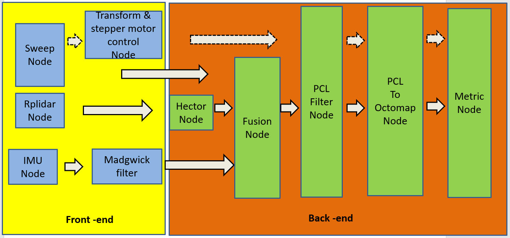
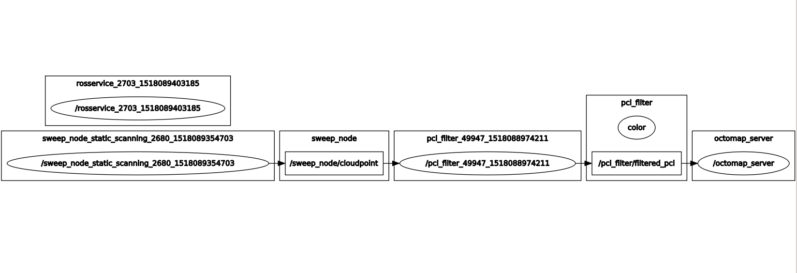

# Project: Portabal 3D Mapping device based on 2D Lidar ############
This repository is established for the master thesis program, to generate 3D mapping based on 2D Lidar, 2 modes can be chosen, mapping along motion & mapping from static locations. The generated map can be compared with the metric.
---

**Setup Work on Laptop**

---

# Set up the Ros-kinetic version on your laptop
## 1.workspace at laptop
Catkin-tools is integrated into the ros framework, the build and init of workspace can be referred in [catkin tool](http://catkin-tools.readthedocs.io/en/latest/installing.html). Copy catkin_ws, the whole folder into the home folder on your pc.
```
$ cd ~/catkin_ws/
$ catkin_make

```
 Running it the first time in your workspace, it will create a CMakeLists.txt link in your 'src' folder. Additionally, if in your current directory you should now have a 'build' and 'devel' folder. Inside the 'devel' folder you can see that there are now several setup.*sh files. Sourcing any of these files will overlay this workspace on top of your environment. 
```
$ source ~/catkin_ws/devel/setup.bash

```

To make sure your workspace is properly overlayed by the setup script, make sure ROS_PACKAGE_PATH environment variable includes the directory you're in.
``` 
$ echo $ROS_PACKAGE_PATH /home/youruser/catkin_ws/src:/opt/ros/kinetic/share

```
## 2. Ros-kinetic Desktop-Full Version Install (Recommended):
this version includes all common tools on Ros, follow the instructions from [installation on Ubuntu](http://wiki.ros.org/kinetic/Installation/Ubuntu), the ubuntu version should be <b> Ubuntu 16.04.3 LTS (Xenial Xerus) 64 bit</b>
## 3. PCL 1.7 Installation
this (PCL) is a standalone, large scale, open project for 2D/3D image and point cloud processing. [PCL installation](http://pointclouds.org/downloads/). Here two options can be offered,
<b>3.1 Integration with ROS</b> PCL (verison 1.7) is the backbone of ROS to process the 3D pointcloud, The library is written in c++, the installed Ros-kinetic, by default includes already the pcl-ros package. If you want to use PCL in you own project, like some other packages created by your own, follow the tutorials here, [PCL in your own project](http://pointclouds.org/documentation/tutorials/using_pcl_pcl_config.php#using-pcl-pcl-config), here the ralative path >"~/catkin_ws/src/fusion_octomap/CMakeLists.txt" is already modified according to the tutorial, so this own defined package can be directly compiled properly.<br />
2 <b>3.2 PCL python</b> My code for Sweep lidar node is written in python, so the pcl python libarry should also be installed, in fact, >python-pcl includes a subset of functionalites of pcl, but that's enough.<br />
Some basic commands to install python-pcl are:
### Install cython
```
$ sudo pip install cython

```
### Build and Install pcl-python
```
$ cd ~/catkin_ws/src/python-pcl
$ python setup.py build
$ sudo python setup.py install

```
### Install pcl-tools
```
$ sudo apt-get install pcl-tools

```
### Documentation for pcl_helper.py
pcl_helper.py contains useful functions for working with point cloud data with ROS and PCL. The file itself is located in >"~/catkin_ws/src/fusion_octomap/scripts/pcl_helper.py", Functions used in my workspace:
```
ros_to_pcl(sensor_msgs/PointCloud2)

```
Converts sensor_msgs/PointCloud2 back to XYZRGB Point Cloud<br />
```
pcl_to_ros(pcl.PointCloud_PointXYZRGB)

```
Converts XYZRGB Point Cloud to sensor_msgs/PointCloud2 <br />
## 4. Octomap installation
<b>4.1 Integration with ROS</b> The command below will install the octomap package,
```
$ sudo apt-get install ros-kinetic-octomap

```
<b>4.2 stand-alone library</b> To install OctoMap as stand-alone libraries with no ROS dependencies (so the package can also be used in a non-ROS setting). This work is already done for workspace, normally the CMakeLists.txt in your own package folder should be modified as below:
```
find_package(octomap REQUIRED)
include_directories(${OCTOMAP_INCLUDE_DIRS})
target_link_libraries(${OCTOMAP_LIBRARIES})
(Add link_directories(${OCTOMAP_LIBRARY_DIRS}) only if required - usually it's not needed).

```
package.xml is supposed to modified accordingly, add to your package.xml:
```
<build_depend>octomap</build_depend>
<run_depend>octomap</run_depend>

```
This work is done already for my own package >"~/catkin_ws/src/fusion_octomap", the CMakeLists.txt and package.xml can be used as reference if further developed package should be integrated into the whole work space.

## 5. Visualization software
<b>a. pcl_viewer</b> <br />
pcl-viewer is a software to visualize pointcloud on your pc, installation commands as below:
```
$ sudo add-apt-repository ppa:v-launchpad-jochen-sprickerhof-de/pcl
$ sudo apt-get update
$ sudo apt-get install libpcl-all

```
The pointcloud is dumped into pcd file, some pcd files, generated from four types of maps are located in >"~/catkin_ws/src/fusion_octomap/*.pcd", to open a pcd file in pcl_viewer, the command is called as following, here, e.g. we want to open the fused_pcd.pcd file:
```
$ cd ~/catkin_ws/src/fusion_octomap/point_cloud/fused_pcd.pcd
$ pcl_viewer fused_pcd.pcd

```
The default background color is black, to change it to white, the command should be appended with the inputs:
```
$ pcl_viewer downsampling_filter.pcd  -bc 1,1,1 

```
To see more information about how to use pcl_viewer, you can press "h" in the opened the viewer window.
<b>b. octovis</b> <br />
octovis is available in the ros-kinetic-octomap debian package. As an alternative, you can download the package yourself from [octomap](http://octomap.github.io) and compile it with the library stand-alone or against a locally installed octomap library. To install octovis on Ubuntu using the pre-built packages, run command below:
```
$ sudo apt-get install ros-kinetic-octovis

```
The octomap is dumped into *.ot or *.bt file, these files are located in >"~/catkin_ws/src/fusion_octomap/binary_maps/*.ot", to open a *.ot file in octovis, the command is called as following, here, e.g. we want to open the single-pose.ot file:
```
$ cd ~/catkin_ws/src/fusion_octomap/binary_maps/single-pose.ot
$ octovis single-pose.ot

```
The depth of octree, and the color can be modified in tool bar at right and at top of the octovis window.
---
**Setup Work on Raspberry -pi**
---
All the work is put in a "~/slam_ws" wrokspace. The most convenient method is to clone the current whole system image on the Raspi from the SD card, and back up it or burn it into additional SD card, this mirror image contains the built_in ros framework, and the i2c-tools via
```
$ sudo apt-get install i2c-tools

```
The imu and stepper motor are connected via i2c, after the connection 
```
$ sudo i2cdetect -y 1

```
For more i2c installation details, please refer to [i2c on Raspberry](http://skpang.co.uk/blog/archives/575)<br />
[SMBus python](https://github.com/pimoroni/py-smbus) is a python library for i2c protocol, to be used for our python coding.

---
**Run Ros Nodes**
---
# Set up Ros network
The network should be set up to notify the nodes run on different machines,
1. Make sure the raspberry and your PC, both are connected to a same wireless local network, all the machines are supposed to be connected to HUAWEI-681D, portable WIFI, on raspberry this should be checked via "ifconfig", because it may connect to other signals nearby. <br />
 
2. Change the ip address, the ip address file is located in "etc/hosts" on ubuntu system directory. open the hosts with root permission and copy the ip address of your pc and raspberry, e.g., format is ip address followed by hostname <br />:
```
192.168.8.102	desktop

```
3. Export your ip address into the terminal where you will launch the node later, this should be done both for raspberry and you pc, you can use ssh to remotely log into the raspberry and do the settings remotely.<br />
```
$ export ROS_MASTER_URI=http://192.168.8.--:11311
$ export ROS_IP=http://192.168.8.*:11311

```
ROS_MASTER_URI is a required setting that tells nodes where they can locate the master. It should be set to the XML-RPC URI of the master. This ROS_MASTER_URI is supposed to be same on different machines, and set to the IP of the machine, you will run roscore on. Great care should be taken when using localhost, as that can lead to unintended behaviors with remotely launched nodes. The second command ROS_IP is the real IP address of the machine,  if the static ip address is used, then for convenience you can also copy the commands above into your ~/.bashrc file and then source it with the path to be imported in the terminal to launch rosnode.
```
$ echo 'export ROS_MASTER_URI=http://192.168.8.--:11311' >> ~/.bashrc 
$ echo 'export ROS_IP=http://192.168.8.--:11311' >> ~/.bashrc 

```
4. Export your ip address into the terminal where you will launch the node later<br />
5. Call the roscore on the machine whose IP address is consistent with ROS_MASTER_URI. The terminal shouldn't be terminated during the whole working process, because it is responsible for communication between different nodes.<br /> 
```
$ roscore

```
6. Run Ros nodes in the workspace, which is compiled, each node is an individual process, there are two way for running of these nodes, one is through launch file to launch a batch of nodes sequentially,<br />
 ```
$ roslaunch package-name launchfile-name.launch

```
The name through "TAB" to be completed, or you can also run the node separately in each terminal,<br />
 ```
$ rosrun package-name nodename

```
# Change USB permission & port number
cd to the "/dev/ttyUSB*", then chang permission
 ```
sudo chmod 666 /dev/ttyUSB*

 ```
the USB port should be consistent to the sensor's real port connecting to Raspberry PI, after USB connection, the real port number can be found under folder /dev, both Lidar is via ttyUSB*, for Rplidar, this number can be changed in the launch file, locating in "~/slam_ws/src/rplidar_ros/launch/perception.launch".
 ```
<launch>
  <node name="rplidarNode"          pkg="rplidar_ros"  type="rplidarNode" output="screen">
  <param name="serial_port"         type="string" value="/dev/ttyUSB2"/>  
  <param name="serial_baudrate"     type="int"    value="115200"/>
  <param name="frame_id"            type="string" value="laser"/>
  <param name="inverted"            type="bool"   value="false"/>
  <param name="angle_compensate"    type="bool"   value="true"/>
  </node>

  <!--node name="Imu" pkg="mems_10dof" type="imu.py" output="screen"/-->
</launch>

```
Change the value of the name "serial_port" to the real number, for sweep this can be configured inside the python codes
 ```
with Sweep('/dev/ttyUSB0') as sweep:
               # Create a scanner object
               time.sleep(1.0)
             
               scanner = Scanner( \
               device=sweep, base=base, settings=settings, exporter=exporter)

               # Setup the scanner
               scanner.setup()

               # Perform the scan
               scanner.perform_scan()

```
The parameters of Sweep Lidar should be changed according real number, 

---
**Reference Map Generation**
---
The reference map can be 
# Nodes on Raspberry

<br />&emsp; &emsp;  &emsp;  &emsp; &emsp; &emsp;  &emsp;  &emsp; &emsp; &emsp;  &emsp;  &emsp;&emsp; &emsp;  &emsp;  &emsp;Overall nodes flow<br />

<br />&emsp; &emsp;  &emsp;  &emsp; &emsp; &emsp;  &emsp;  &emsp; &emsp; &emsp;  &emsp;  &emsp;&emsp; &emsp;  &emsp;  &emsp;Static scanning<br />
1. Setup IP  and MASTER_URI for this node and source the bash file:
```
$ export ROS_MASTER_URI=http://192.168.8.--:11311
$ export ROS_IP=http://192.168.8.*:11311
$ source ~/slam_ws/devel/setup.bash

```
2. cd to the path "/slam_ws/src/scanner_3d/scanner_3d/", within the scan_settings.py, the line 26 to line 35
```
if motor_speed is None:
   motor_speed = sweep_constants.MOTOR_SPEED_2_HZ  # 1HZ
if sample_rate is None:
   sample_rate = sweep_constants.SAMPLE_RATE_1000_HZ  #500HZ
if deadzone is None:
   deadzone = 135  #135
if scan_range is None:
   scan_range = 180  #180

```
The first two line are the rotating speed and sampling rate, these parameters shoudl be changed before the main node is running up. These default parameters will be loaded into the Lidar, 
3. cd to the path "/slam_ws/src/scanner_3d/scanner_3d/", then in the same terminal with exported IP address, run the node, via 
```
$ python scanner.py

```
4. Open another termianl, do the same work for IP and Ros path.
```
$ export ROS_MASTER_URI=http://192.168.8.--:11311
$ export ROS_IP=http://192.168.8.*:11311
source ~/slam_ws/devel/setup.bash

```
call the service,
```
rosservice call /sweep_node/times "Pose_num: 4"
rosservice call /sweep_node/poses [400.0,800.0,800.0,400.0] [100.0,100.0,500.0,500.0] [94.0,94.0,94.0,94.0]

```
Only the valus should be modified according to the real locations, the first value to "Pose_num" is number of locations, after the service is properly recieved, the "success" will be returned to the request terminal, then the second command is to provide the coordinate of each location, x-y-z in oder. <br />
The scanning process at each location will be performed repeatedly.  


